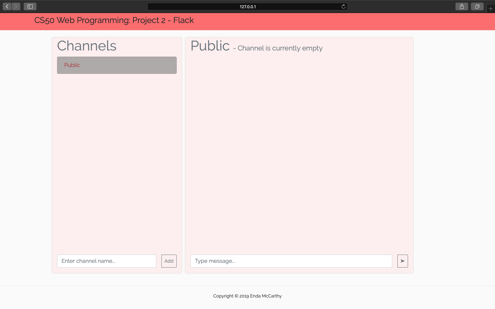
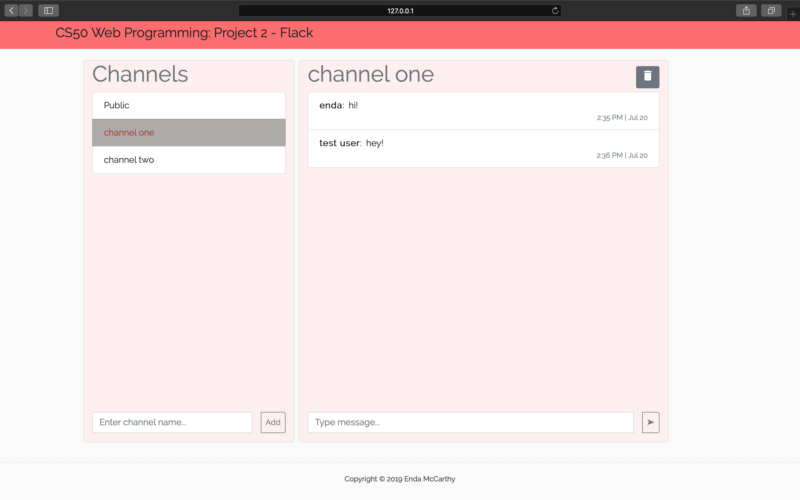

## Project 2 - Flack
### Enda McCarthy
#### Web Programming with Python and JavaScript

This is a messaging application. Users can enter with a username, create channels and send messages back and forth within the channels.

This is an example of a single page application. There is only one html page (index.html) and the user does not need to move from this page or reload it.

I used websockets to communicate between the server and client in order to display messages in realtime. The Socket.io Javascript library is used for this.

Some features include:
- signing in with a username
- ability to create channels
- abilty to delete channels if you are the creator of them
- sending messages within channels
- messages and channel additions appear in realtime for all users viewing the page
- username and timestamp displayed with every message
- remembering the channel which the user was last on if the page is closed and reopened

The styling of the page is used using SASS (.scss) and Flask is used as a Python framework.
See link to the project requirements [here](https://docs.cs50.net/web/2018/x/projects/2/project2.html).

There are a number of improvements which could be made given enough time, including:
- ability to delete messages
- chatting with specific individuals
- including attachments with messages
- sign out button

See below screengrabs of the page. It is not currently hosted anywhere.

